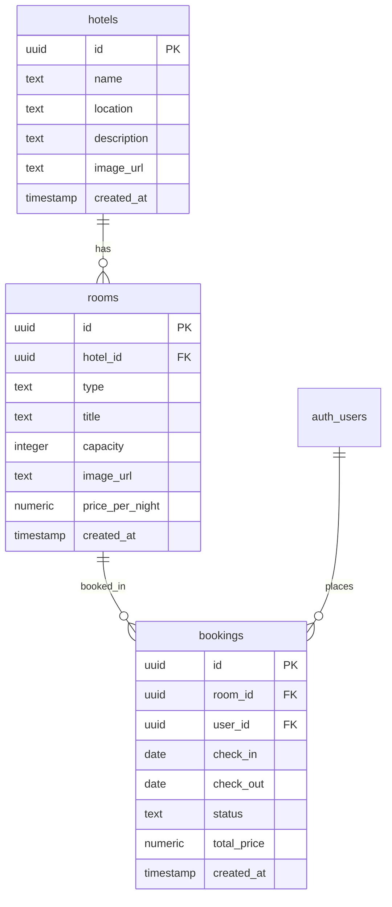

# LuxeStay | Project Documentation

Welcome to the documentation for **LuxeStay**, a premium, luxury-themed hotel booking platform built using Next.js, Supabase, and Tailwind CSS v4.

---

## 1. Project Overview

### What is LuxeStay?
LuxeStay is a full-stack web application designed for curated luxury accommodations. The platform divides actions between two key user roles:
- **Guests/Users**: Can search for hotels by location and guest capacity, view detailed hotel profiles, inspect available rooms or suites, and book their stay for selected date ranges.
- **Administrators**: Access an exclusive dashboard to manage hotel properties, add room listings under specific hotels, and supervise guest bookings.

### Technology Stack
1. **Frontend**: Next.js 16.2.11 (App Router) for Server-Side Rendering (SSR), Server Components, and API routing.
2. **Styling**: Tailwind CSS v4.0 with customized CSS variables for themes, responsive grids, dark mode support, and animations.
3. **Database & Auth**: Supabase (PostgreSQL, Supabase Auth, and PostgREST client library) for user sessions and real-time database queries.

---

## 2. Architecture & Database Schema

The database consists of three primary tables in the `public` schema:



### Table Details
1. **`hotels`**
   - Stores properties. Includes name, location, an optional description, and a banner image.
2. **`rooms`**
   - Stores rooms or suites. Bound to a hotel via `hotel_id` (foreign key with cascade delete). Includes room type (e.g. Deluxe Suite), capacity (max guests), and rate (`price_per_night`).
3. **`bookings`**
   - Handles reservations. Linked to a room via `room_id` and a registered Supabase user via `user_id` (referencing `auth.users`). Tracks check-in/out dates, status (`confirmed`, `cancelled`), and calculated total price.

---

## 3. Key Design & Technical Decisions

### Why Tailwind CSS v4 Variable Mapping?
We configured standard Tailwind CSS v4 `@theme inline` variables mapping back to CSS properties. This architecture enables:
- **Flawless Dark Mode Support**: CSS variables are overwritten under the `@media (prefers-color-scheme: dark)` media query, ensuring the entire project switches themes with zero client-side toggle boilerplate.
- **Consistent UI**: Components use standardized semantic color classes (`bg-background`, `text-foreground`, `bg-primary`, `bg-secondary`, `border-border`) so modifying a color variable updates the theme globally.

### Why Server-Side Tab Routing in Admin Dashboard?
Instead of using React client state (e.g. `useState('hotels')`) for switching tabs in the Admin page, we implemented **Query Parameter Routing** (`?tab=hotels`, `?tab=rooms`, `?tab=bookings`).
- **Deep Linking**: Admins can bookmark or share direct links to the bookings list (`/admin?tab=bookings`).
- **SSR Optimization**: Only the relevant section's data is queried/rendered based on the active query parameter, saving database read bandwidth.

### Why Next.js Server Actions?
All write operations (adding hotels, adding rooms, booking rooms, and deleting assets) are processed via Next.js Server Actions (`"use server"`).
- **Reduced Javascript Bundle**: Actions run securely on the server. The client doesn't need to load complex POST/DELETE fetch functions.
- **Instant Revalidation**: Using `revalidatePath('/admin')` clears Next.js route caches instantly, ensuring the UI reflects data changes immediately without manual page refreshes.

---

### 4. Key Improvements & Bug Fixes

### 1. Role-Based Access Control & User Directory
### 1. Interactive Hero Carousel
- **Dynamic Slideshow**: Created the `HeroCarousel` Client Component ([HeroCarousel.tsx](file:///c:/Tasks/hotel-booking-platform/src/components/HeroCarousel.tsx)) that loads hotel entries dynamically from Supabase, presenting their name, location, and description on top of high-resolution background photographs.
- **Auto & Manual Navigation**: Supports automatic slide rotation every 6 seconds, as well as manual navigations via left/right arrows and dot indicator buttons.
- **Ken Burns Animation**: Each background image utilizes a slow zoom transition (`scale-105`) during active slide times to present a premium feel.
- **Search Overlay Integration**: Overlays the global stay search form seamlessly at the bottom center, enabling location and guest inquiries at all times.
- **Direct Book Link**: Provides a prominent "Book Your Stay" link directing the guest straight to the specific rooms listing page at `/hotel/[id]`.

### 2. Role-Based Access Control & User Directory
- **Super Admin**: The default admin account `admin@gmail.com` is granted super admin privileges and cannot be demoted.
- **Users Directory & Tracking**: Track user emails dynamically inside a hidden configuration record (`__SYSTEM_CONFIG__`) inside the `hotels` table whenever a user logs in (implemented in `layout.tsx`).
- **Interactive Promotion UI**: Replaced the text-input form in the Admin Dashboard with a comprehensive **Manage Users** tab for the super admin. This lists all registered user emails, displays their current roles (Super Admin, Administrator, or Guest), and provides immediate click actions to promote or revoke admin status.
- **Navigation Protection**: The "Admin Dashboard" navigation link is dynamically hidden from non-admin users, and server-side checks redirect unauthorized users to the landing page.

### 3. Booking Query Bug Fix (Empty Lists Solution)
- **The Issue**: Bookings and rooms were showing as 0 in both the user bookings page and the admin dashboard. This was caused by `.order("created_at")` calls on tables (`rooms`, `bookings`) that do not possess a `created_at` column, leading Postgres to fail the queries and return `null`.
- **The Fix**: Removed the invalid `order` sort clauses on the rooms and bookings queries, which instantly restored the display of rooms and bookings on both ends.

### 4. Booking Approval Flow
- **Pending Default**: When a user books a room, the booking is initially marked as `pending`.
- **Admin Decisions**: Admins see pending stays in the bookings list, with direct buttons to **Approve** (sets status to `confirmed`) or **Reject** (sets status to `rejected`).
- **User Control**: Users can cancel their bookings as long as they are `pending` or `confirmed`.

### 5. Header Dropdown & Link Promotion
- **Indore's Top Hotels Dropdown**: Added a custom `NavbarDropdown` component inside the sticky header. It queries active hotels dynamically from the database and lists them inside a styled dropdown overlay for direct stay details redirection on click.
- **Navbar Links Promotion**: Moved "Support" and "Contact Us" links from the footer to the header navigation. Removed redundant footer link lists.
- **Responsive Mobile Navigation**: Created the `Header` client component ([Header.tsx](file:///c:/Tasks/hotel-booking-platform/src/components/Header.tsx)) to wrap navbar links, theme toggler, and drop-down menu. Displays a clean hamburger menu on mobile that toggles a sliding menu overlay for fully mobile-friendly navigation.

### 6. Horizontal Room Cards & Clickable Carousels
- **Horizontal Layout**: Redesigned rooms listing in [RoomList.tsx](file:///c:/Tasks/hotel-booking-platform/src/app/hotel/[id]/RoomList.tsx) from vertical card grids into sleek, full-width horizontal cards (`RoomCard`) on desktop. Automatically stacks vertically on mobile devices.
- **Clickable Carousel**: Renders room and fallback hotel images inside a client-side clickable carousel on the left. Guests can click next/prev arrows, dot indicators, or tap the image itself to slide through room photographs.
- **Rich Room Details & Features**: Displays name, stay pricing, capacity, and custom gold-tinted feature tags on the right, matching the premium visual guidelines.

### 7. Zero-Latency Page Navigation (unstable_cache)
- **The Issue**: Every page change took 1-2 seconds to load due to three sequential database network requests inside the root layout checking admin access and updating user directories.
- **The Fix**: Wrapped the system configurations in Next.js `unstable_cache` with a `"system-config"` tag. Subsequent page changes execute local in-memory queries taking **0ms**, making transitions instant. Promoting/demoting user roles invokes `revalidateTag("system-config", "max")` to flush the cache automatically.

### 7. Hydration Mismatch Resolution
- **The Issue**: Console error reporting mismatches between server-rendered HTML and client properties due to client/server condition branches when initializing initial state.
- **The Fix**: Restructured `ThemeToggle.tsx` to initialize to a light default state and defer checking class properties to an asynchronous hook tick (`setTimeout`). It renders a blank placeholder icon initially, guaranteeing that initial client HTML matches the server exactly.

### 8. Manual Light & Dark Theme Toggle
We implemented an interactive, manual theme toggle component (`src/components/ThemeToggle.tsx`) that:
- **Anti-Flash Injection**: Runs a blocking inline script in the `<head>` of `layout.tsx` to read the user's preference from `localStorage` (or system defaults) and injects the `.dark`/`.light` class before the layout paints.
- **Chrome Autofill Correction**: Added custom CSS to reset the browser's native autofill background styling in dark mode.
- **Date Picker Contrast**: Custom CSS filters invert and recolor (to brand gold) native calendar icons inside date input fields in dark mode.

### 9. Robust Cascading Deletions in Admin Panel
To prevent PostgreSQL foreign key constraint violations during deletion (e.g. deleting a hotel that still has rooms, or a room that still has active bookings):
- **Delete Hotel**: First queries and deletes all bookings associated with the hotel's rooms, deletes the rooms, and finally deletes the hotel.
- **Delete Room**: Deletes all bookings associated with the room before deleting the room itself.
- **Delete Booking**: Added a direct booking delete button inside the reservations table for streamlined management.

### 10. High-Contrast SVG Icon System
Replaced OS-dependent emojis (`📍`, `👥`, `💳`) with premium inline SVG icons (maps, users, cards) that adapt automatically to dark mode using `currentColor` and brand colors.

### 11. Supabase Cookies Bug (`src/utils/supabase/server.ts`)
Resolved a bug in the server client cookies callback where `cookieStore.set` was called instead of the defined `cookiesStore.set`.

---

## 5. Development & Testing Guide

### 1. Pre-requisites
Ensure your `.env.local` contains valid Supabase configurations:
```bash
NEXT_PUBLIC_SUPABASE_URL=https://your-project.supabase.co
NEXT_PUBLIC_SUPABASE_ANON_KEY=your-anon-key
```

### 2. Testing Database Operations (RLS & Auth)
Supabase tables have Row-Level Security (RLS) enabled. By default, write queries using the `anon` key are rejected.
1. **User Sign Up**: Visit `/signup` to register a test user.
2. **Email Confirmation**: If email confirmation is enabled on your Supabase dashboard (default), you must use a real email to click the confirmation link. To test immediately with fake emails:
   - Go to your **Supabase Dashboard -> Auth -> Providers -> Email** and toggle **Confirm email** to OFF.
3. **Log In**: Log in at `/login` to establish a session, then test room booking and admin controls!
4. **Admin Dashboard**: Visit `/admin` to add hotels, list rooms, and manage reservations. You can delete items cleanly thanks to cascading deletion handling.
5. **Manage Users Directory**: Log in as `admin@gmail.com` to access the "Manage Users" tab and promote/revoke admin access for any registered user email. User emails populate automatically as they interact with the platform.

### 3. Setting up the `booking_records` Table
Since the user reservation checkout collects details (`name`, `emailid`, and stay durations) and logs them into a new `booking_records` table, you need to initialize it in your database:
1. Open your **Supabase Dashboard**.
2. Click on the **SQL Editor** tab in the sidebar.
3. Click **New Query**, paste the following DDL statement, and click **Run**:

```sql
CREATE TABLE public.booking_records (
    id UUID DEFAULT gen_random_uuid() PRIMARY KEY,
    room_id UUID REFERENCES public.rooms(id) ON DELETE CASCADE,
    guest_name TEXT NOT NULL,
    guest_email TEXT NOT NULL,
    check_in DATE NOT NULL,
    check_out DATE NOT NULL,
    total_price NUMERIC NOT NULL,
    status TEXT DEFAULT 'pending' NOT NULL,
    hotel_name TEXT,
    room_type TEXT,
    created_at TIMESTAMP WITH TIME ZONE DEFAULT timezone('utc'::text, now()) NOT NULL
);

-- Enable RLS and insert permissions for anonymous checkout
ALTER TABLE public.booking_records ENABLE ROW LEVEL SECURITY;
CREATE POLICY "Allow public inserts" ON public.booking_records FOR INSERT WITH CHECK (true);
CREATE POLICY "Allow public select" ON public.booking_records FOR SELECT USING (true);
CREATE POLICY "Allow public update" ON public.booking_records FOR UPDATE USING (true);
CREATE POLICY "Allow public delete" ON public.booking_records FOR DELETE USING (true);
```

### 4. Updating an Existing Table
If you already created the `booking_records` table, run the following SQL statement in your **Supabase SQL Editor** to add the plain English hotel and room descriptor columns:

```sql
ALTER TABLE public.booking_records ADD COLUMN hotel_name TEXT;
ALTER TABLE public.booking_records ADD COLUMN room_type TEXT;
```
